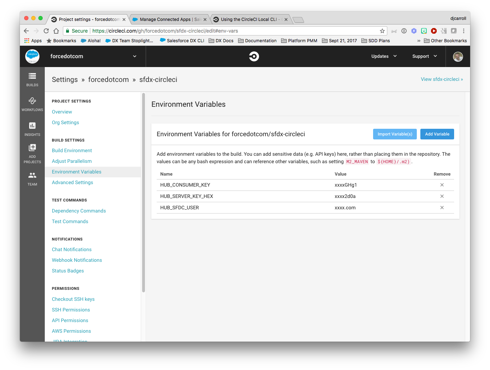

# sfdx-circleci [](https://travis-ci.org/forcedotcom/sfdx-travisci)

Coming Soon --- For a fully guided walk through of setting up and configuring this sample, see the [Continuous Integration Using Salesforce DX](https://trailhead.salesforce.com/modules/sfdx_travis_ci) Trailhead module.

This repository shows one way you can successfully setup Salesforce DX with Circle CI. We make a few assumptions in this README:

- You know how to get your Github repository setup with Circle CI. (Here's their [Getting Started guide](https://circleci.com/docs/2.0/).)
- You have properly setup JWT-Based Authorization Flow (i.e. headless). I recommend using [these steps for generating your Self-Signed SSL Certificate](https://devcenter.heroku.com/articles/ssl-certificate-self). 

If any any of these assumptions aren't true, the following steps won't work.

## Getting Started

1) Make sure you have the Salesforce CLI installed. Check by running `sfdx force --help` and confirm you see the command output. If you don't have it installed you can download and install it from [here](https://developer.salesforce.com/tools/sfdxcli).

2) Confirm you can perform a JWT-based auth: `sfdx force:auth:jwt:grant --clientid <your_consumer_key> --jwtkeyfile server.key --username <your_username> --setdefaultdevhubusername`

   **Note:** For more info on setting up JWT-based auth see [Authorize an Org Using the JWT-Based Flow](https://developer.salesforce.com/docs/atlas.en-us.sfdx_dev.meta/sfdx_dev/sfdx_dev_auth_jwt_flow.htm) in the [Salesforce DX Developer Guide](https://developer.salesforce.com/docs/atlas.en-us.sfdx_dev.meta/sfdx_dev).

3) [Fork](http://help.github.com/fork-a-repo/) this repo into your github account using the fork link at the top of the page.

4) Clone your forked repo locally: `git clone https://github.com/<git_username>/sfdx-circleci.git`

4) Encrypt and store the server.key generated above.
> "Circle does a nice job of allowing you to set environment variables inside the UI in a 
  protected way. Because OpenSSL likes key files formatted in a particular fashion, we'll convert 
  it to hex for storage in env variables. This will make it easier to create a valid key file 
  on the fly in the build later." (attribution to [Kevin O'Hara](https://github.com/kevinohara80))

 * Generate keys to encrypt you server.key file locally and then decrypt your server key within CircleCI

```bash
$ openssl enc -aes-256-cbc -k <passphrase here> -P -md sha1 -nosalt
  key=E5E9FA1BA31ECD1AE84F75CAAA474F3A663F05F412028F81DA65D26EE56424B2
  iv =E93DA465B309C53FEC5FF93C9637DA58
```

> Make note of the `key` and `iv` values output to the screen. You will use the values following `key=` and `iv =` to encrypt your `server.key` in the next step.

 * Encrypt the `server.key` using the newly generated `key` and `iv` values.  These values can only be generated once, so if you lose these values you will need to generated new ones and encrypt again.

```bash
openssl enc -nosalt -aes-256-cbc -in server.key -out server.key.enc -base64 -K <key from above> -iv <iv from above>
```
 
 * Store the `key`, `iv` and contents of `server.key.enc` as protected environment variables in the Circleci UI.

5) From you JWT-Based connected app on Salesforce, retrieve the generated `Consumer Key`.


6) Set your `HUB_CONSUMER_KEY`, `HUB_SERVER_KEY_HEX` and `HUB_SFDX_USER` using the CircleCi UI. Note that this username is the username that you use to access your Dev Hub.



10) IMPORTANT! Remove your `server.key`: `rm assets/server.key`, you should never store keys or certificates in a public place.

And you should be ready to go! Now when you commit and push a change, your change will kick off a Travis CI build.

Enjoy!

## Contributing to the Repository ###

If you find any issues or opportunities for improving this repository, fix them!  Feel free to contribute to this project by [forking](http://help.github.com/fork-a-repo/) this repository and make changes to the content.  Once you've made your changes, share them back with the community by sending a pull request. Please see [How to send pull requests](http://help.github.com/send-pull-requests/) for more information about contributing to Github projects.

## Reporting Issues ###

If you find any issues with this demo that you can't fix, feel free to report them in the [issues](https://github.com/forcedotcom/sfdx-circleci/issues) section of this repository.

Test
